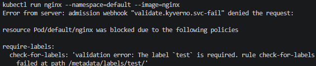
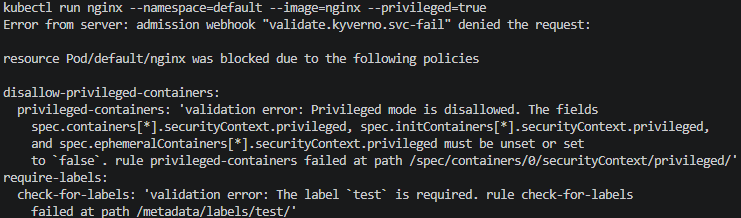

# Kyverno with Policy Enforcement

## Overview
This project deploys Kyverno and demonstrates baseline Kubernetes policy enforcement using admission control, without modifying any workload manifests.

Every `Pod` create request is validated by Kyverno's admission webhook against the cluster's `ClusterPolicy` resources; requests that violate a policy are rejected before they reach the API server's storage.

This project uses `kubectl run` for demonstration purposes only and is not intended for production use.

## Goals
- Install Kyverno in a dedicated namespace.
- Enforce non-privileged container execution.
- Enforce required labels on resources.

## Architecture
```
kubectl (Pod create request)
  │
  ▼
Kyverno admission webhook (validate.kyverno.svc-fail)
  ├── disallow-privileged-containers  ──► blocks spec.containers[*].securityContext.privileged
  └── require-labels                  ──► blocks Pods missing metadata.labels.test
                    │
                    └── allowed / denied response to the API server
```

## Repository Structure
- `policies/disallow-privileged-containers.yaml`: `ClusterPolicy` that blocks privileged containers.
- `policies/require-labels.yaml`: `ClusterPolicy` that requires label key `test`.

## Prerequisites
- A Kubernetes cluster
- `kubectl`
- `helm`

## Deployment
### 1) Install Kyverno
```bash
helm repo add kyverno https://kyverno.github.io/kyverno/
helm repo update

helm install kyverno kyverno/kyverno \
--version=3.4.4 \
--namespace=kyverno \
--create-namespace \
--wait \
--wait-for-jobs
```

### 2) Apply the policies
```bash
kubectl apply --filename=policies/disallow-privileged-containers.yaml
kubectl apply --filename=policies/require-labels.yaml
```

## Validation
Confirm both policies are ready:
```bash
kubectl get clusterpolicy
```

Attempt to run a privileged Pod without labels — blocked by both policies:
```bash
kubectl run nginx --namespace=default --image=nginx --privileged=true
```

Attempt to run a Pod without the required label — blocked by `require-labels`:
```bash
kubectl run nginx --namespace=default --image=nginx
```

A Pod that is non-privileged and carries the `test` label is admitted:
```bash
kubectl run nginx --namespace=default --image=nginx --labels="test=true"
```

## Screenshots
Pod missing the required label rejected by `require-labels`:


Privileged Pod rejected by `disallow-privileged-containers` and `require-labels`:


## Cleanup
```bash
kubectl delete --filename=policies/disallow-privileged-containers.yaml
kubectl delete --filename=policies/require-labels.yaml
helm uninstall kyverno --namespace=kyverno
```