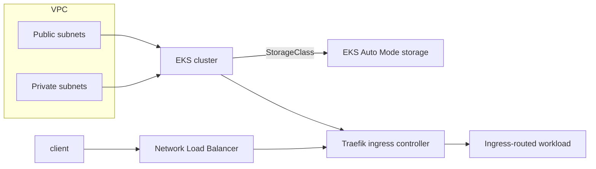

# Terraform Amazon EKS Cluster with Ingress Traefik Controller

## Overview
This project provisions AWS networking, an Amazon EKS cluster, and the Traefik Ingress Controller using Terraform.

## Security Warning
This guide includes HTTP access checks on port 80 for validation only. Use HTTPS/TLS for production endpoints, enforce redirection from HTTP to HTTPS, and avoid exposing sensitive traffic over plain HTTP.

## Goals
- Create a VPC with public and private subnets.
- Provision EKS and configure access.
- Deploy Traefik Ingress Controller through Helm.
- Create Kubernetes StorageClass for EKS Auto Mode.

## Architecture


## Repository Structure
- `main.tf`: core infrastructure and Helm resources.
- `variables.tf`: project input variables.
- `outputs.tf`: exported values.
- `providers.tf`, `terraform.tf`: provider and backend settings.

## Prerequisites
- AWS account with permissions for VPC/EKS/NLB
- S3 bucket for Terraform state
- `terraform`
- `aws`
- `kubectl`

## Usage
### 1) Initialize Terraform backend
```bash
export AWS_ACCESS_KEY_ID=<REDACTED>
export AWS_SECRET_ACCESS_KEY=<REDACTED>
export AWS_REGION=<REDACTED>

terraform init \
-backend-config="bucket=<REDACTED>" \
-backend-config="key=state/$(basename $(pwd))/terraform.tfstate" \
-backend-config="region=${AWS_REGION}"
```

### 2) Deploy infrastructure
```bash
terraform apply
```

### 3) Configure kubeconfig
```bash
aws eks update-kubeconfig --name <cluster_name>
```

## Validation
```bash
kubectl get service --namespace=traefik

export NLB_ADDRESS=$(kubectl get service traefik --namespace=traefik --output=jsonpath='{.status.loadBalancer.ingress[0].hostname}')

kubectl create deployment nginx --namespace=default --image=nginx:1.29 --replicas=1
kubectl expose deployment nginx --namespace=default --port=8080 --target-port=80
kubectl create ingress nginx --namespace=default --class=traefik --rule="${NLB_ADDRESS}/nginx*=nginx:8080"

curl http://${NLB_ADDRESS}/nginx
curl https://${NLB_ADDRESS}/nginx --insecure
```

## Cleanup
```bash
helm uninstall traefik --namespace=traefik
terraform destroy
```