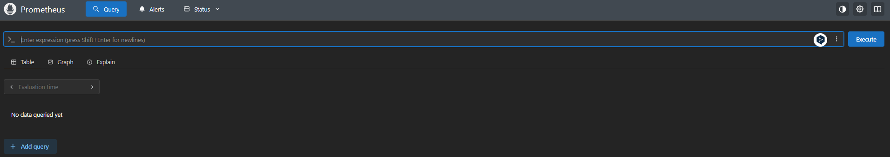
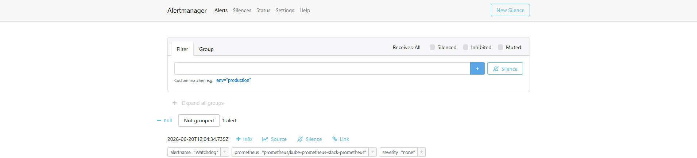
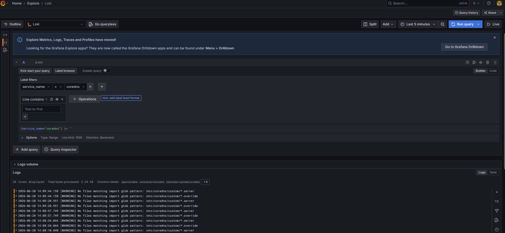

# Monitoring and Observability with Prometheus, Grafana, and Loki

## Overview
This project deploys a Kubernetes observability stack using Terraform and Helm: kube-prometheus-stack (Prometheus, Alertmanager, Grafana), Loki, and Promtail.

This project uses HTTP for demonstration purposes only and is not intended for production use.

## Goals
- Deploy Prometheus, Alertmanager, and Grafana via kube-prometheus-stack.
- Deploy Loki and Promtail for log collection and querying.
- Expose observability tools behind a configured ingress hostname.

## Architecture
```
Kubernetes cluster
  ├── Promtail (DaemonSet) ──► Loki (SingleBinary + MinIO)
  │                                         │
  └── kube-prometheus-stack                 │
        ├── Prometheus                      │
        ├── Alertmanager                    │
        └── Grafana ◄────────────────────── ┘
              (datasources: Prometheus, Loki)

Traefik (ingress controller)
  ├── /prometheus   → Prometheus
  ├── /alertmanager → Alertmanager
  └── /grafana      → Grafana
```

## Repository Structure
- `main.tf`: Helm releases for Traefik, kube-prometheus-stack, Loki, and Promtail.
- `variables.tf`: input variables such as ingress hostname.
- `outputs.tf`: Terraform outputs.
- `versions.tf`: Terraform/provider version constraints.

## Prerequisites
- Kubernetes cluster with a valid `~/.kube/config`
- `terraform`
- `kubectl`

## Deployment
### 1) Initialize
```bash
export TF_VAR_ingress_hostname=<hostname>
terraform init
```

### 2) Deploy
```bash
terraform apply
```

## Validation
After deployment, verify endpoints:
- `http://<hostname>/prometheus`
- `http://<hostname>/alertmanager`
- `http://<hostname>/grafana`

Retrieve the Grafana admin password:
```bash
kubectl get secret kube-prometheus-stack-grafana --namespace=prometheus --output=json | jq --raw-output '.data."admin-password"' | base64 --decode
```

## Screenshots

Prometheus — cluster and workload metrics:


Alertmanager — alert routing and silences:


Loki — pod logs collected by Promtail:


## Cleanup
```bash
terraform destroy
unset TF_VAR_ingress_hostname
```
